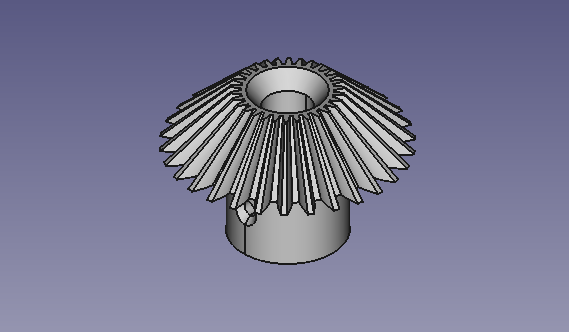
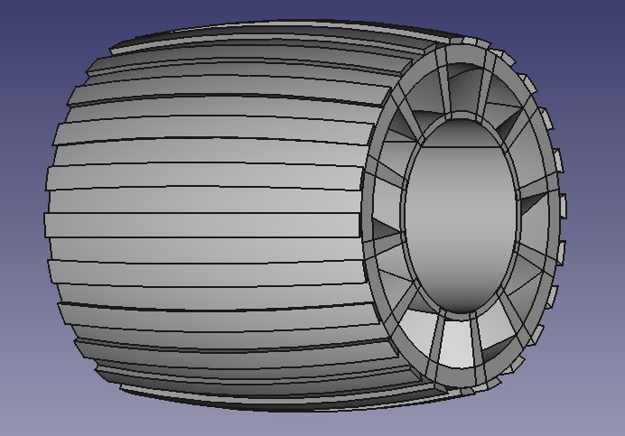
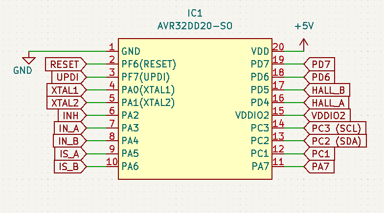

# earth_rover1
Repository for designs and code snippets for a small rover-type robot. The goal is to build a small rover, featuring a rocker-bogie suspension with a differential gearbox. Circuit designs primarily revolve around motor control circuitry, but power distribution circuits are also planned. The repository contains part designs (FreeCAD and .stl) as well as circuit designs (KiCAD).

## Mechanics
The rover features a driving motor in each wheel as well as a motor turning the front and back wheels around the vertical axis.
The rover is designed to be modular, such that wheel configurations can be changed, for instance by allowing for quickly removing wheels. This will allow the rover to emulate other common wheel configurations, such as a classic differential drive with 2 or 4 driven wheels, or Ackermann-steered vehicles. For this to function, future part designs able to lock the suspension into place are still required.

## Electronics
Electrically, the rover has a Teensy 4 MCU, as the central controller. Each motor is connected to its own motor control circuit, which communicates with the central controller over a I2C bus. The motor control circuits are equipped with their own MCU (AVR32 16DD20) to handle encoder- and current sense feedback. This architecture allows to test both architectures with local control and central planning, or fully centralized planning and control.

Sensing capabilities are currently limited to:
* Accelerometer, gyroscope, and magnetometer (MEMS)
* Wheel encoders
* Motor current

## Bill of Materials
To be updated

Mechanical:
* 2x 1m aluminium pipe
* 6x 6810RS Deep Groove Ball Bearing
* 6x 6000RS Deep Groove Ball Bearing
* 44x M3x16mm Countersink screws (subject to change)
* 16x M3x8mm Countersink screws (subject to change)
* 12x M3x12mm Countersink screws (subject to change)
* 3x M3x35mm Countersink screws
* 20x M3 Lock nuts
* 30x M4x20mm Countersink screws

Electrical:
* 6x DFRobot FIT185, 12V DC motor, 45kg.cm, w. encoder
* 4x 4401 Stepper Motor
* 4x A4988 Stepper Motor Driver
* 1x Teensy 4.1
* 1x LSM6DSOX + LIS3MDL IMU and magnetometer module

## Future improvements
Future additions will include:
* Manipulator
* Vision system for object identification, visual servoing, etc.
* GPS
* Telemetry

When the hardware reaches maturity for testing, this will also include control algorithms, examples, and descriptions.
